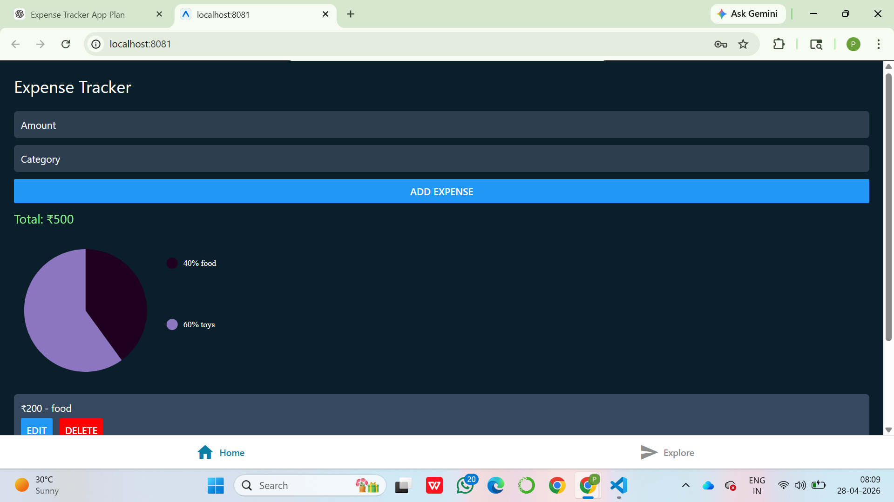
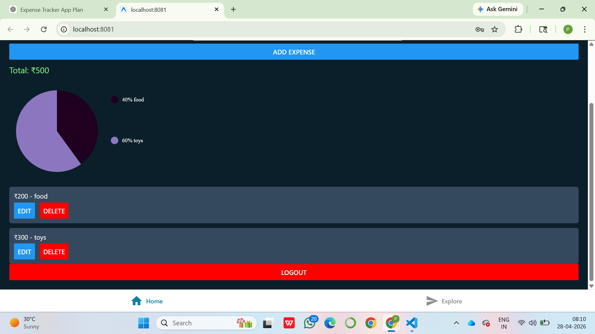
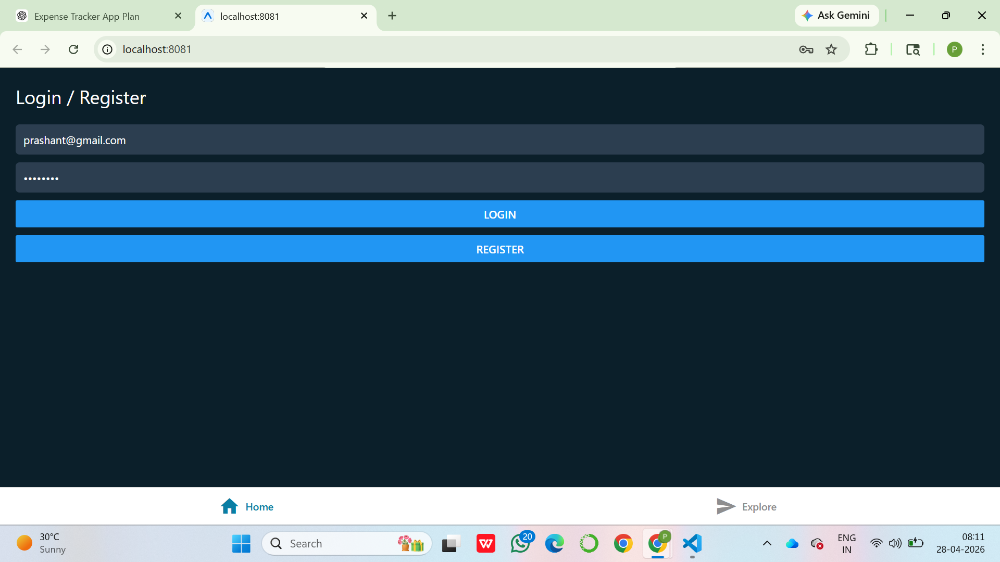
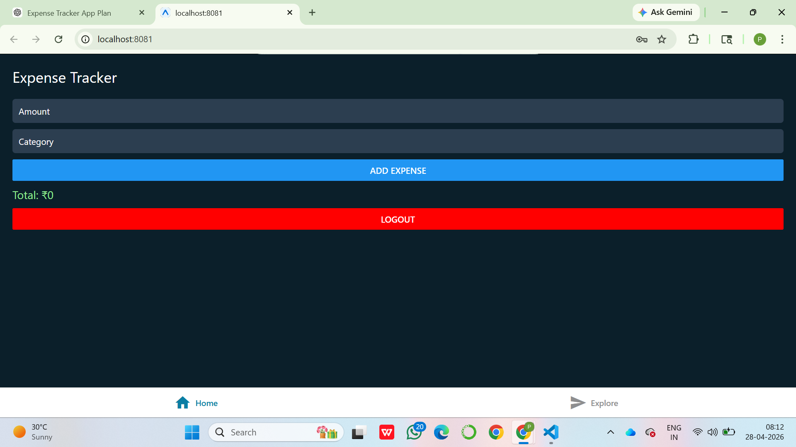

# 📱 Expense Tracker App (React Native + Node.js + MongoDB)

## 🚀 Project Overview

This is a full-stack **Expense Tracker Mobile App** built using **React Native (Expo)** for the frontend and **Node.js + Express + MongoDB** for the backend.

The app allows users to:

- Register & Login securely using JWT authentication
- Add, edit, and delete expenses
- View total expenses
- See category-wise expense distribution using charts

---

## 🛠 Tech Stack

### Frontend

- React Native (Expo)
- TypeScript
- Axios
- React Native Chart Kit

### Backend

- Node.js
- Express.js
- MongoDB (Mongoose)
- JWT Authentication
- bcrypt (Password hashing)

---

## ✨ Features

### 🔐 Authentication

- User Registration
- User Login (JWT based)
- Secure API access using token

### 💰 Expense Management

- Add Expense (amount, category)
- Edit Expense
- Delete Expense
- Fetch user-specific expenses

### 📊 Dashboard

- Total expense calculation
- Category-wise Pie Chart visualization

### ⚙️ Additional

- Error handling
- Loading states
- Protected routes (JWT middleware)

---

## 📂 Project Structure

```
expense-tracker/
│
├── backend/
│   ├── routes/
│   ├── models/
│   ├── middleware/
│   ├── server.js
│   └── package.json
│
├── frontend/
│   ├── app/
│   │   └── (tabs)/
│   │       └── index.tsx
│   ├── components/
│   └── package.json
```

---

## ⚙️ Setup Instructions

### 🔹 1. Clone Repository

```
git clone https://github.com/your-username/expense-tracker.git
cd expense-tracker
```

---

### 🔹 2. Backend Setup

```
cd backend
npm install
```

Create `.env` file:

```
MONGO_URI=your_mongodb_connection
JWT_SECRET=your_secret_key
PORT=5000
```

Run backend:

```
node server.js
```

---

### 🔹 3. Frontend Setup

```
cd frontend
npm install
```

Start app:

```
npx expo start
```

---

### 📱 Run on Mobile

- Install **Expo Go** app
- Scan QR code from terminal

---

### 🌐 Run on Web (Optional)

Press:

```
w
```

---

## 🔗 API Endpoints

### Auth

- POST `/api/auth/register`
- POST `/api/auth/login`

### Expenses (Protected)

- GET `/api/expenses`
- POST `/api/expenses`
- PUT `/api/expenses/:id`
- DELETE `/api/expenses/:id`

---

## 📸 Screenshots

- Login Screen
- Dashboard
- Expense List
- Chart View
  
  
  
  

---

## ⚠️ Notes

- App tested on:
  - Web (Expo)
  - Mobile (Expo Go)

- Backend runs on:

```
http://localhost:5000
```

---

## 🎯 Evaluation Criteria Covered

✅ React Native UI & component design
✅ State management (useState / useEffect)
✅ API integration (Axios)
✅ JWT Authentication
✅ CRUD operations
✅ Error handling
✅ Clean code structure

---

## 📌 Future Improvements

- Add date & notes field
- Offline support
- Redux / Context API
- Better UI/UX animations

---

## 🙌 Author

**Prashant Aryan**
